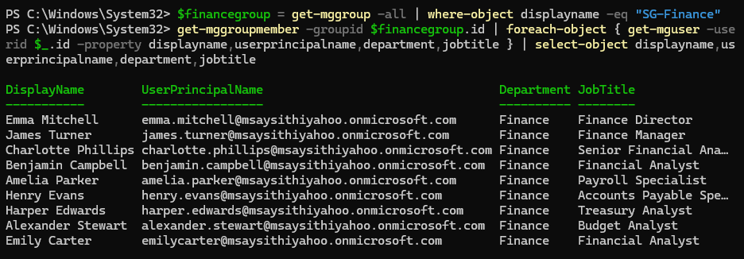
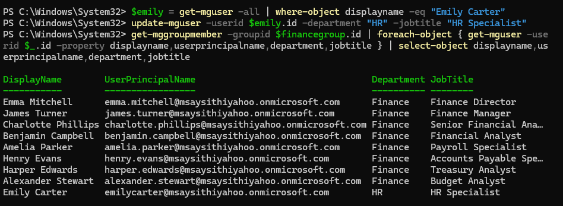
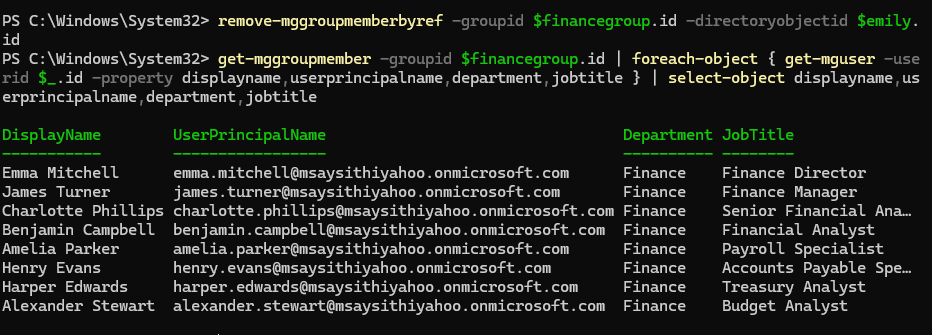

<h1>Microsoft Entra ID - Access Review & Certification</h1>

In this lab, I performed a quarterly access review of a Finance security group in Microsoft Entra ID. I reviewed existing group membership against current user attributes, identified inappropriate access caused by a role change, made an access certification decision, and remediated the stale access using Microsoft Graph PowerShell.  

<h2>Environments and Technologies Used</h2>

&nbsp;&nbsp; 

- Microsoft Entra ID
- Microsoft Graph PowerShell
- PowerShell
- Microsoft Entra Security Groups

<h2>IAM Concepts Demonstrated</h2>

- Access Reviews
- Access Certification
- Access Governance
- Identity Governance
- Role-Based Access Control (RBAC)
- Least Privilege
- Stale Access Identification
- Access Remediation
- Group-Based Access Management

<h2>High-Level Steps</h2>

- Step 1. Review current SG-Finance membership
- Step 2. Identify access that no longer aligns with the user's current role
- Step 3. Make a certification decision and remediate inappropriate access
- Step 4. Verify the resulting access state

<h2>Actions and Observations</h2>

<b>1. FINANCE ACCESS REVIEW</b>

A quarterly access certification was performed for the SG-Finance security group. I used Microsoft Graph PowerShell to retrieve the group's current members and their identity attributes, including department and job title.

The initial review established the current Finance access population and provided a baseline for evaluating whether each user's access remained appropriate.

> [!NOTE]
> Access reviews help organizations periodically validate that existing permissions remain appropriate rather than assuming previously granted access is still required.

<b>2. IDENTIFYING INAPPROPRIATE ACCESS</b>

To simulate a stale-access scenario, I updated Emily Carter's department and job title to represent a transfer from Finance to HR while intentionally leaving her existing SG-Finance membership unchanged. This created a realistic condition where a user's business role had changed, but access associated with the previous role had not been removed.

I then performed the Finance access review again. Emily Carter was identified as an access exception because her current identity attributes showed HR / HR Specialist while she remained a member of SG-Finance.

Based on the user's current role and department, the certification decision for Emily's SG-Finance access was:

<b>DENY / REVOKE</b> - Finance access was no longer required.

The remaining users whose Finance roles aligned with SG-Finance membership were considered appropriate for continued access.

> [!IMPORTANT]
> Identifying access that no longer aligns with a user's business role helps enforce least privilege and reduces the risk of access accumulation over time.

<b>3. ACCESS REMEDIATION AND VERIFICATION</b>

Following the certification decision, I removed Emily Carter from SG-Finance using Microsoft Graph PowerShell.

I then reran the Finance membership report to verify that the inappropriate access had been successfully removed while the appropriate Finance users retained their existing access.

The final membership review confirmed that Emily Carter was no longer a member of SG-Finance.

<h2>Lab Summary</h2>

This lab demonstrated a manual access review and certification workflow in Microsoft Entra ID. I reviewed existing security group membership, compared access against current identity attributes, identified stale access, made an access certification decision, remediated the inappropriate group membership, and verified the resulting access state.

The lab reinforced how access reviews, access certification, least privilege, RBAC, and access governance help prevent users from retaining permissions that are no longer required for their current roles.

> [!NOTE]
> This lab manually demonstrates the access review and certification process using Microsoft Graph PowerShell and Microsoft Entra ID. Automated Microsoft Entra Access Reviews are an Identity Governance capability that requires additional Microsoft Entra licensing.
